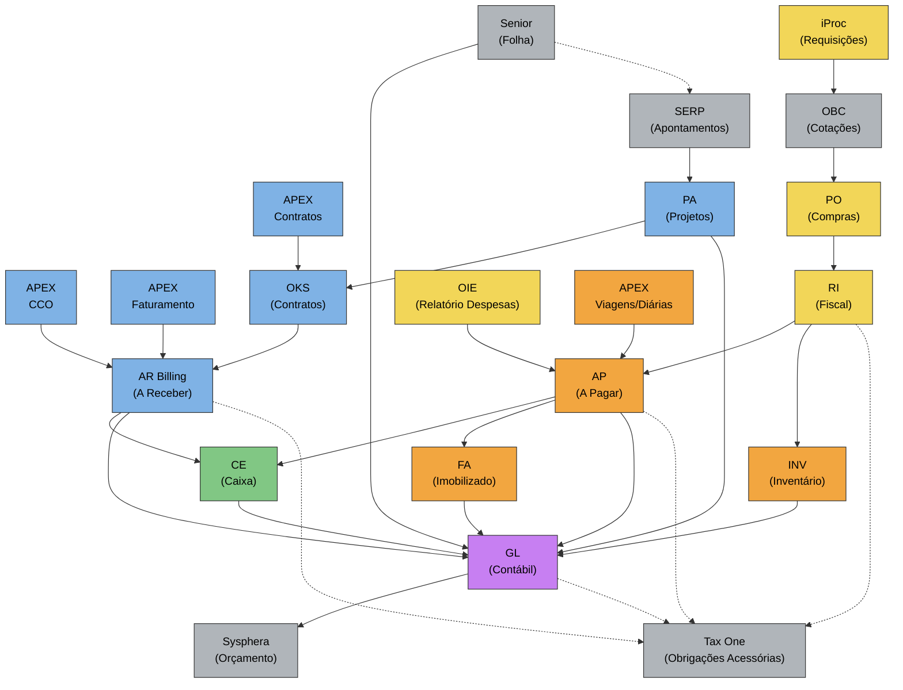

```mermaid

flowchart TD
    %% Definindo as cores
    classDef blue fill:#7fb2e5,stroke:#333,stroke-width:1px,color:#000
    classDef gray fill:#b0b5ba,stroke:#333,stroke-width:1px,color:#000
    classDef red fill:#f26b6b,stroke:#333,stroke-width:1px,color:#000
    classDef yellow fill:#f2d658,stroke:#333,stroke-width:1px,color:#000
    classDef orange fill:#f2a640,stroke:#333,stroke-width:1px,color:#000
    classDef purple fill:#c77ff2,stroke:#333,stroke-width:1px,color:#000
    classDef pink fill:#f2a7c5,stroke:#333,stroke-width:1px,color:#000
    classDef green fill:#81c784,stroke:#333,stroke-width:1px,color:#000

    %% NÓS DO DIAGRAMA
    %% Gray (External Systems / HR / Planning)
    SERP["SERP\n(Apontamentos)"]:::gray
    Senior["Senior\n(Folha)"]:::gray
    Sysphera["Sysphera\n(Orçamento)"]:::gray

    %% Blue (Vendas e Contratos)
    APEX_CCO["APEX\nCCO"]:::blue
    APEX_Contratos["APEX\nContratos"]:::blue
    APEX_Faturamento["APEX\nFaturamento"]:::blue
    PA["PA\n(Projetos)"]:::blue
    OKS["OKS\n(Contratos)"]:::blue
    AR["AR Billing\n(A Receber)"]:::blue

    %% Yellow (Compras e Despesas)
    iProc["iProc\n(Requisições)"]:::yellow
    OBC["OBC\n(Cotações)"]:::gray
    PO["PO\n(Compras)"]:::yellow
    RI["RI\n(Fiscal)"]:::yellow
    OIE["OIE\n(Relatório Despesas)"]:::yellow

    %% Orange (Fiscal, Inventário e Ativos)
    FA["FA\n(Imobilizado)"]:::orange
    AP["AP\n(A Pagar)"]:::orange
    INV["INV\n(Inventário)"]:::orange
    APEX_Viagens["APEX\nViagens/Diárias"]:::orange

    %% Green (Caixa e Bancos)
    CE["CE\n(Caixa)"]:::green

    %% Purple (Contabilidade Core)
    GL["GL\n(Contábil)"]:::purple

    %% Pink (Obrigações Fiscais)
    TaxOne["Tax One\n(Obrigações Acessórias)"]:::gray

    %% CONEXÕES (SETAS)
    %% Lado Esquerdo (Projetos, Vendas, Contratos, RH)
    Senior --> GL
    Senior -.-> SERP
    SERP --> PA
    APEX_Contratos --> OKS
    APEX_CCO --> AR
    APEX_Faturamento --> AR
    PA --> OKS
    PA --> GL
    OKS --> AR
    AR --> CE
    AR --> GL
    
    %% Lado Direito (Compras, Inventário, Fiscal)
    iProc --> OBC
    OBC --> PO
    PO --> RI
    RI --> AP
    RI --> INV
    OIE --> AP
    APEX_Viagens --> AP
    INV --> GL
    FA --> GL
    AP --> CE
    AP --> FA
    AP --> GL

    %% Centro (Caixa e Contábil)
    CE --> GL
    GL --> Sysphera

    %% Integrações com Tax One (Pink)
    AR -.-> TaxOne
    AP -.-> TaxOne
    RI -.-> TaxOne
    GL -.-> TaxOne

```
